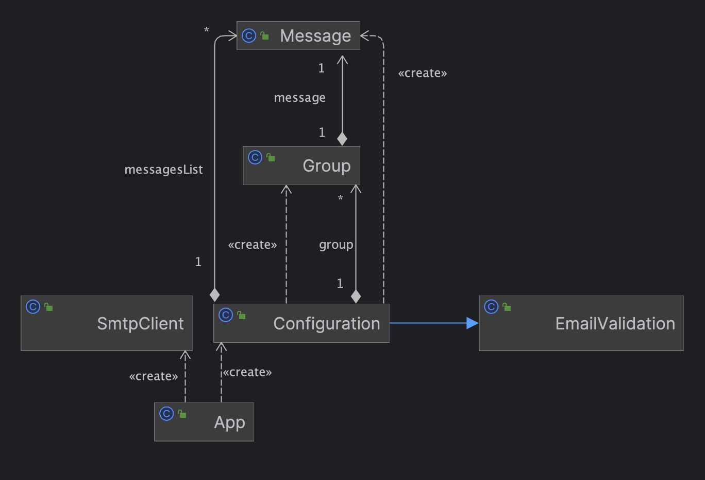

# Rapport laboratoire no4 - SMTP
Kevin Auberson et Adrian Rogner
## Introduction
Ce rapport présente le laboratoire no4 du cours de Développement d'applications Internet. 

L'objectif de ce laboratoire est de développer une application client qui permet d'envoyer des courriels à des victimes. 
L'application doit être configurable et doit permettre d'envoyer un courriel à un groupe de victimes.

## Mock SMTP Server
### Description
Pour tester l'application, nous avons utilisé un serveur SMTP mock.  
Ce serveur permet de simuler un serveur SMTP et de recevoir les courriels envoyés par l'application.
Nous utilisons un serveur mock afin d'éviter d'utiliser un serveur SMTP en production.
Ce serveur mock est déployé sur docker et est accessible à l'adresse suivante: [Mock SMTP Server](https://github.com/maildev/maildev).

### Configuration
Pour installer le serveur SMTP mock, il faut suivre les étapes suivantes:

1. Installer docker sur votre machine
2. Lancer le serveur SMTP mock avec la commande suivante:
```bash
docker run -d -p 1080:1080 -p 1025:1025 maildev/maildev
```
3. Accéder à l'interface web du serveur SMTP mock à l'adresse suivante: [Mock SMTP Server](http://localhost:1080/)
4. Accéder au serveur SMTP mock à l'adresse suivante: [Mock SMTP Server](http://localhost:1025/)


## Client SMTP
### Description
Le client SMTP permet d'envoyer des "Pranks" à plusieurs adresses mails en lui fournissant une liste d'adresse mail et des messages à envoyer.
### Configuration
Il faut tout d'abord cloner le repository sur votre machine.
<br/>Ensuite créer le fichier jar en utilisant la commande maven ci-dessous
```bash
mvn clean package
```
Le fichier jar est utilisable ainsi en fournissant les arguments requis en ligne de commande.
Les fichiers requis pour utiliser ce programme sont une liste d'adresse mail et une liste de messages.<br/>
Ces fichiers doivent être au format utf8, txt, utf16be ou utf16le. <br/>
Dans le fichier qui contient les adresses mails il faut séparer chacun d'entre eux avec une virgule. <br/>
Par exemple : 
```bash
test@gmail.com, test2@gmail.com
```
Dans le fichier des messages chacun d'entre eux doit être séparé séparé avec "---".</br>
Le contenu doit être spécifié à l'aide des mot-clés "Subject: " et "Body: " <br/>
Par exemple : 
```bash
Subject: Chasse
Body: Bonjour je souhaite chasser
---
Subject: Espionnage
Body: Bonjour je suis un espion
```
### Utilisation
Pour utiliser le client SMTP il faut exécuter le fichier jar en ligne de commande en passant en argument la liste des victims, la liste des messages à envoyer et le nombre de groupe de victim qui correspond au nombre d'envoie de mail.
Il est également possible d'indiquer l'adresse IP du serveur qu'on veut utiliser ainsi que le  numéro de port en les passants en 4ème et 5ème argument.
<br/><br/>
Exemple d'utilisation :
```bash
java -jar SMTP-1.0.jar victims.txt messages.txt 4
```
Cette commande permet d'utiliser les fichiers victims pour configurer les groupes, attribuer un message qui sera envoyer dans chaque groupe avec un maximum de 4 groupes sur le serveur localhost avec le port 1025.
<br/><br/>
```bash
java -jar SMTP-1.0.jar victims.txt messages.txt 4 192.168.1.2 5000
```
Cette commande fait la même chose que la commadne précédente mais en utilisant le serveur avec l'adresse IP 192.168.1.2 et le port numéro 5000.
### Implémentation
### Diagramme de classe

### Exemple de dialogue


Instructions for setting up your mock SMTP server. The user who wants to experiment with your tool but does not really want to send pranks immediately should be able to use a mock SMTP server.

Clear and simple instructions for configuring your tool and running a prank campaign. If you do a good job, an external user should be able to clone your repo, edit a couple of files and send a batch of e-mails in less than 10 minutes.

A description of your implementation: document the key aspects of your code. It is a good idea to start with a class diagram. Decide which classes you want to show (focus on the important ones) and describe their responsibilities in text. It is also certainly a good idea to include examples of dialogues between your client and an SMTP server (maybe you also want to include some screenshots here).