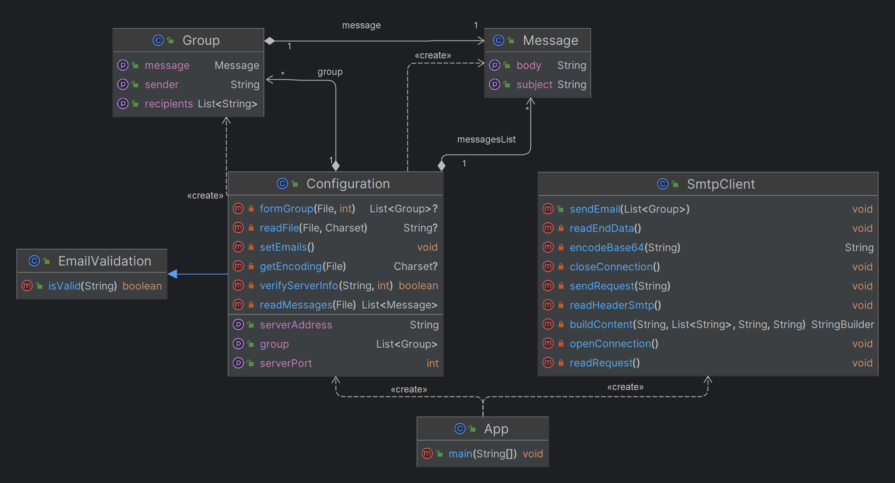

# Rapport laboratoire no4 - SMTP
Kevin Auberson et Adrian Rogner
## Introduction
Ce rapport présente le laboratoire no4 du cours de Développement d'applications Internet. 

L'objectif de ce laboratoire est de développer une application client qui permet d'envoyer des courriels à des victimes. 
L'application doit être configurable et doit permettre d'envoyer un courriel à un groupe de victimes.

## Mock SMTP Server
### Description
Pour tester l'application, nous avons utilisé un serveur SMTP mock.  
Ce serveur permet de simuler un serveur SMTP et de recevoir les courriels envoyés par l'application.
Nous utilisons un serveur mock afin d'éviter d'utiliser un serveur SMTP en production.
Ce serveur mock est déployé sur docker et est accessible à l'adresse suivante: [Mock SMTP Server](https://github.com/maildev/maildev).

### Configuration
Pour installer le serveur SMTP mock, il faut suivre les étapes suivantes:

1. Installer docker desktop sur votre machine
2. Lancer le serveur SMTP mock avec la commande suivante:
```bash
docker run -d -p 1080:1080 -p 1025:1025 maildev/maildev
```
3. Accéder à l'interface web du serveur SMTP mock à l'adresse suivante: [Mock SMTP Server](http://localhost:1080/)
4. Configurer votre application pour qu'elle utilise le serveur SMTP mock à l'adresse suivante: localhost:1025


## Client SMTP
### Description
Le client SMTP permet d'envoyer des "Pranks" à plusieurs adresses mails en lui fournissant une liste d'adresse mail et des messages à envoyer.
### Configuration
Il faut tout d'abord cloner le repository sur votre machine.
<br/>Ensuite créer le fichier jar en utilisant la commande maven ci-dessous (pour ce faire il faut avoir maven d'installé sur votre machine).
```bash
mvn clean package
```
Le fichier jar se trouve dans le dossier target. Il est utilisable ainsi en fournissant les arguments requis en ligne de commande.
Les fichiers requis pour utiliser ce programme sont une liste d'adresse mail et une liste de messages.<br/>
Ces fichiers doivent être au format utf8, txt, utf16be ou utf16le. <br/>
Dans le fichier qui contient les adresses mails il faut séparer chacun d'entre eux avec une virgule. <br/>
Par exemple : 
```bash
test@gmail.com, test2@gmail.com
```
Dans le fichier des messages chacun d'entre eux doit être séparé séparé avec "---".</br>
Le contenu doit être spécifié à l'aide des mot-clés "Subject: " et "Body: " <br/>
Par exemple : 
```bash
Subject: Chasse
Body: Bonjour je souhaite chasser
---
Subject: Espionnage
Body: Bonjour je suis un espion
```
### Utilisation
Pour utiliser le client SMTP il faut exécuter le fichier jar en ligne de commande en passant en argument la liste des victims, la liste des messages à envoyer et le nombre de groupe de victim qui correspond au nombre d'envoie de mail.
Il est également possible d'indiquer l'adresse IP du serveur qu'on veut utiliser ainsi que le  numéro de port en les passants en 4ème et 5ème argument.
Pour ce faire il ne faudra pas oublier de spécifier le chemin absolu ou relatif des fichiers.
<br/><br/>
Exemple d'utilisation :
```bash
java -jar SMTP-1.0.jar victims.txt messages.txt 4
```
Cette commande permet d'utiliser les fichiers victims pour configurer les groupes, attribuer un message qui sera envoyer dans chaque groupe avec un maximum de 4 groupes sur le serveur localhost avec le port 1025.
<br/><br/>
```bash
java -jar SMTP-1.0.jar victims.txt messages.txt 4 192.168.1.2 5000
```
Cette commande fait la même chose que la commadne précédente mais en utilisant le serveur avec l'adresse IP 192.168.1.2 et le port numéro 5000.
## Implémentation
### Diagramme de classe

### Description
#### SmtpClient

La classe SmtpClient représente un client SMTP pour l'envoi d'e-mails via un serveur SMTP. Elle établit une connexion au serveur SMTP, envoie des e-mails à plusieurs destinataires, gère les requêtes et les réponses SMTP, et encode les données conformément aux spécifications SMTP. La classe offre des méthodes pour ouvrir et fermer la connexion, envoyer des e-mails à des groupes spécifiés et construire le contenu des e-mails. Elle utilise des flux d'entrée/sortie pour la communication avec le serveur et consigne les interactions via des logs.
#### Configuration
La classe Configuration gère la préparation des données pour l'envoi d'e-mails. Elle effectue la validation des informations serveur (adresse IP et port), la lecture et l'organisation des messages à partir de fichiers, la création de groupes d'e-mails à partir de listes d'adresses, l'assignation aléatoire de messages à chaque groupe, la lecture de fichiers en tenant compte des jeux de caractères spécifiés et fournit des méthodes pour accéder aux paramètres de configuration.
### Exemple de dialogue
```
PS C:\HEIG\2eme\semestre-1\DAI\Labo\labo4\lab-dai-smtp> java -jar .\target\SMTP-1.0.jar "C:\HEIG\2eme\semestre-1\DAI\Labo\labo4\lab-dai-smtp\resources\victims.txt" "C:\HEIG\2eme\semestre-1\DAI\Labo\labo4\lab-dai-smtp\resources\messages.txt"
 1
Dec 06, 2023 9:58:00 PM ch.heig.dai.smtp.network.SmtpClient openConnection
INFO: Client: connection established
Dec 06, 2023 9:58:01 PM ch.heig.dai.smtp.network.SmtpClient readRequest
INFO: Server: 220 c25382645166 ESMTP
Dec 06, 2023 9:58:01 PM ch.heig.dai.smtp.network.SmtpClient sendRequest
INFO: Client: EHLO 127.0.0.1
Dec 06, 2023 9:58:01 PM ch.heig.dai.smtp.network.SmtpClient readHeaderSmtp
INFO: Server: 250-c25382645166 Nice to meet you, [192.168.65.1]
Dec 06, 2023 9:58:01 PM ch.heig.dai.smtp.network.SmtpClient readHeaderSmtp
INFO: Server: 250-PIPELINING
Dec 06, 2023 9:58:01 PM ch.heig.dai.smtp.network.SmtpClient readHeaderSmtp
INFO: Server: 250-8BITMIME
Dec 06, 2023 9:58:01 PM ch.heig.dai.smtp.network.SmtpClient readHeaderSmtp
INFO: Server: 250 SMTPUTF8
Dec 06, 2023 9:58:01 PM ch.heig.dai.smtp.network.SmtpClient sendRequest
INFO: Client: MAIL FROM: <adrian.rogner@heig.com>
Dec 06, 2023 9:58:01 PM ch.heig.dai.smtp.network.SmtpClient readRequest
INFO: Server: 250 Accepted
Dec 06, 2023 9:58:01 PM ch.heig.dai.smtp.network.SmtpClient sendRequest
INFO: Client: RCPT TO: <test@gmail.com>
Dec 06, 2023 9:58:01 PM ch.heig.dai.smtp.network.SmtpClient readRequest
INFO: Server: 250 Accepted
Dec 06, 2023 9:58:01 PM ch.heig.dai.smtp.network.SmtpClient sendRequest
INFO: Client: RCPT TO: <adrian.test@gmaiol.com>
Dec 06, 2023 9:58:01 PM ch.heig.dai.smtp.network.SmtpClient readRequest
INFO: Server: 250 Accepted
Dec 06, 2023 9:58:01 PM ch.heig.dai.smtp.network.SmtpClient sendRequest
INFO: Client: DATA
Dec 06, 2023 9:58:01 PM ch.heig.dai.smtp.network.SmtpClient sendEmail
INFO: Client: DATA SENT
Dec 06, 2023 9:58:01 PM ch.heig.dai.smtp.network.SmtpClient readEndData
INFO: Server: 354 End data with <CR><LF>.<CR><LF>
Dec 06, 2023 9:58:01 PM ch.heig.dai.smtp.network.SmtpClient readEndData
INFO: Server: 250 Message queued as Tg3vLOz3
Dec 06, 2023 9:58:01 PM ch.heig.dai.smtp.network.SmtpClient sendRequest
INFO: Client: QUIT
Dec 06, 2023 9:58:01 PM ch.heig.dai.smtp.network.SmtpClient readRequest
INFO: Server: 221 Bye
Dec 06, 2023 9:58:01 PM ch.heig.dai.smtp.network.SmtpClient closeConnection
INFO: Client: connection closed
```